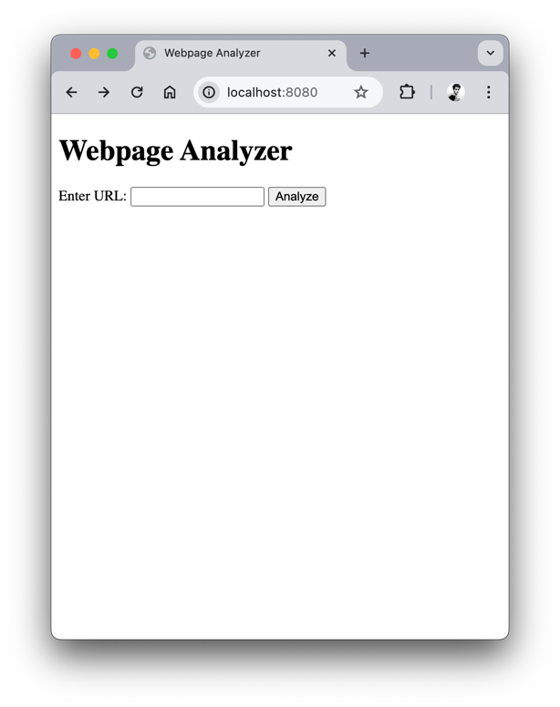
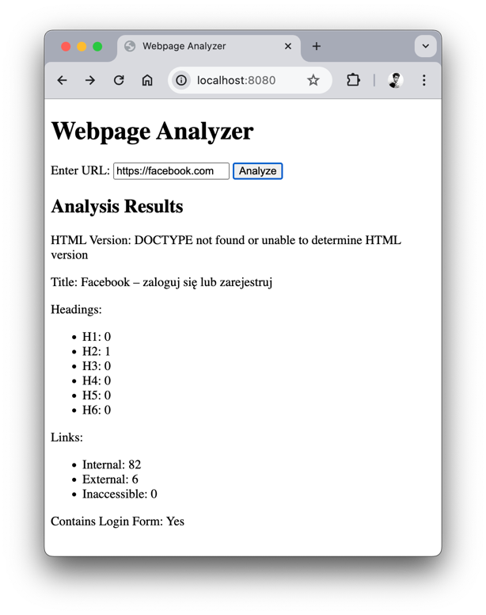
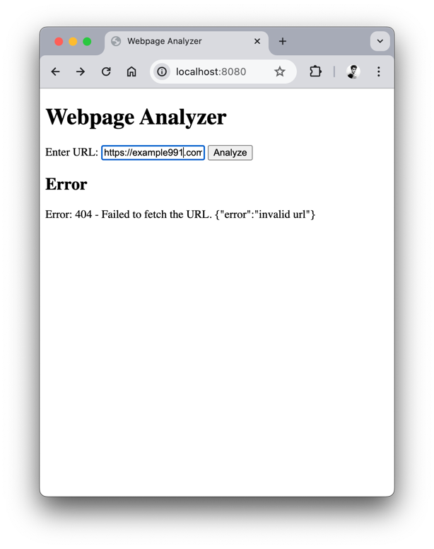

# Webpages Analyzer

The application is designed to analyze web pages.

## To build 
To build the application locally you need `Go` version `1.20` or above installed on your machine.

1. Make a copy of config.toml file 

> cp config.example.toml config.toml

and update the configs if you would use another values.

2. To run application use command

> go run main.go

3. The application is available in browser under address `localhost:8080` if defaults are not changed in `config.toml`

4. To analyze the webpage enter the URL of the website
you want to analyze and click `Analyze`

if the URL is not associated with any website you see the error

## To improve

### Form Analyze:
- More cases should be considered on analyze
- Form analyze not always works correctly (investigate is it a problem of the library)
- 

### Improve frontend

### Try this library

### Improve logger